# Prism — One project, every perspective.

[](https://github.com/devosland/project-cost-calculator/actions/workflows/ci.yml)
[](LICENSE)
[](https://nodejs.org/)
[](https://react.dev/)
[]()

A full-featured project planning, budgeting, and capacity management tool built with React and Express. Plan projects with named resources, track capacity across teams, and manage consultant-to-permanent transitions.

**Live:** [calculateur.danielvaliquette.com](https://calculateur.danielvaliquette.com)

## Screenshots

| Dashboard                                       | Project timeline                                              |
| ----------------------------------------------- | ------------------------------------------------------------- |
| 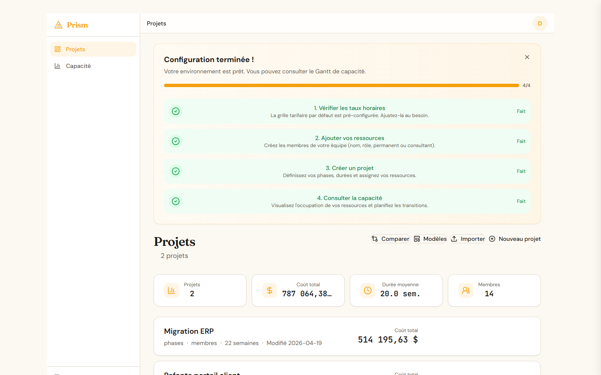 | 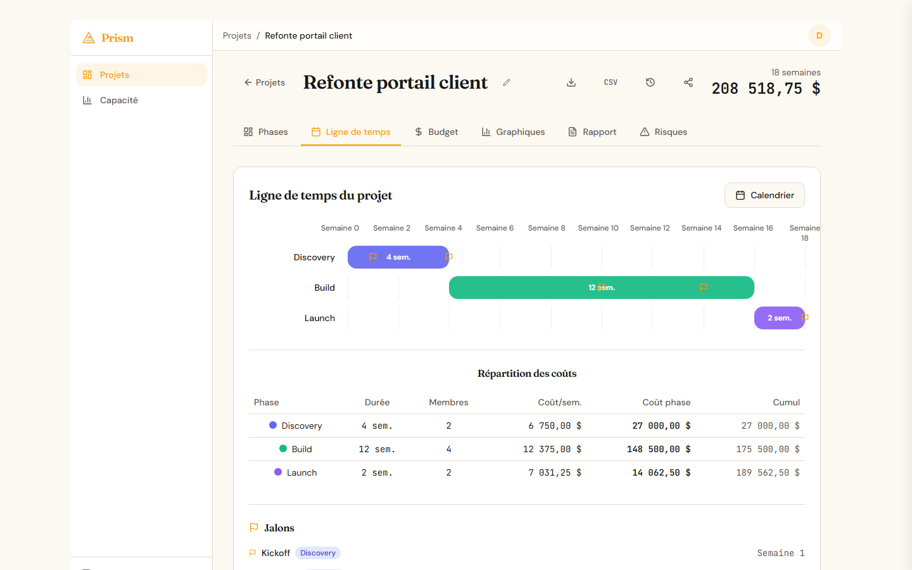 |

| Capacity Gantt                                            | Printable summary                                           |
| --------------------------------------------------------- | ----------------------------------------------------------- |
| 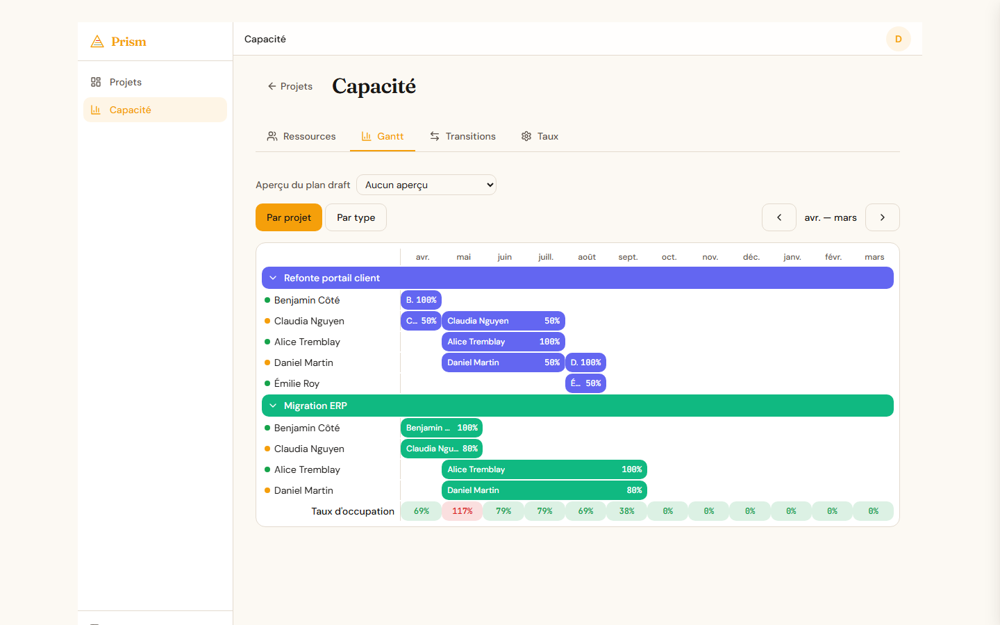 | 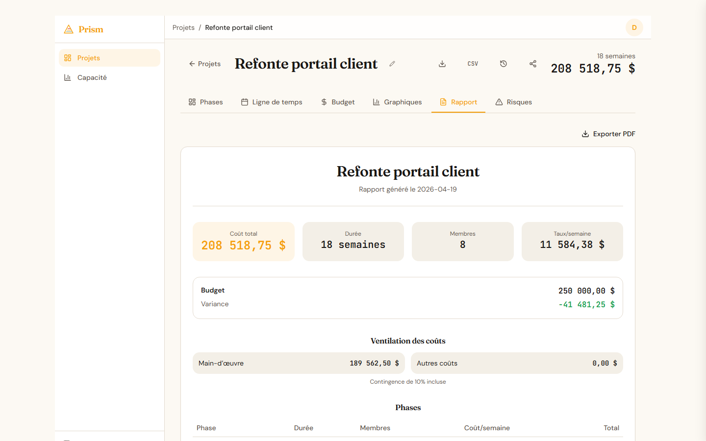 |

<details>
<summary>More screenshots (13 total)</summary>

| Auth                                  | Phases editor                                     |
| ------------------------------------- | ------------------------------------------------- |
| 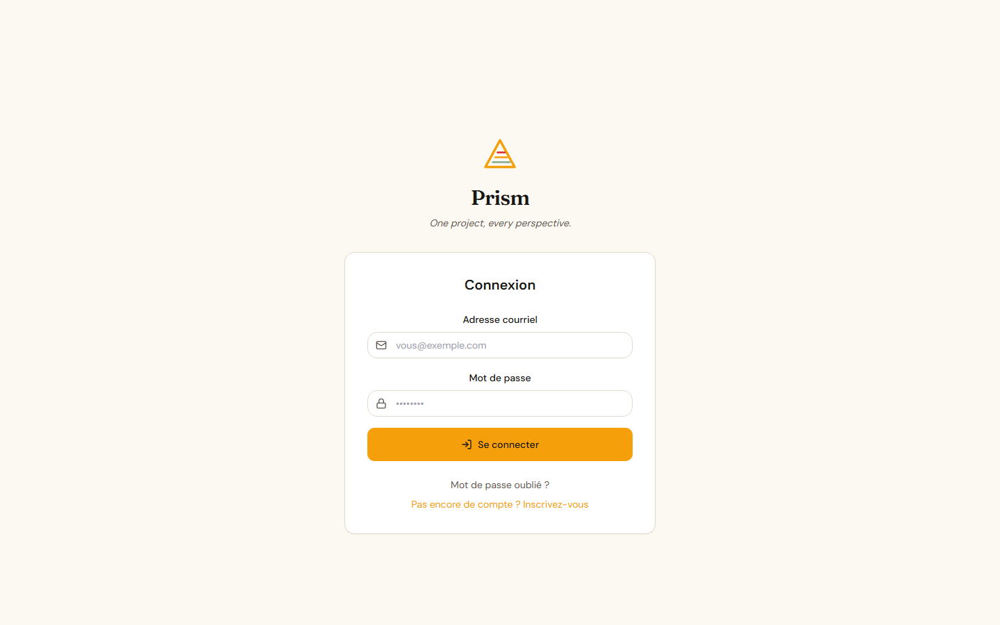 | 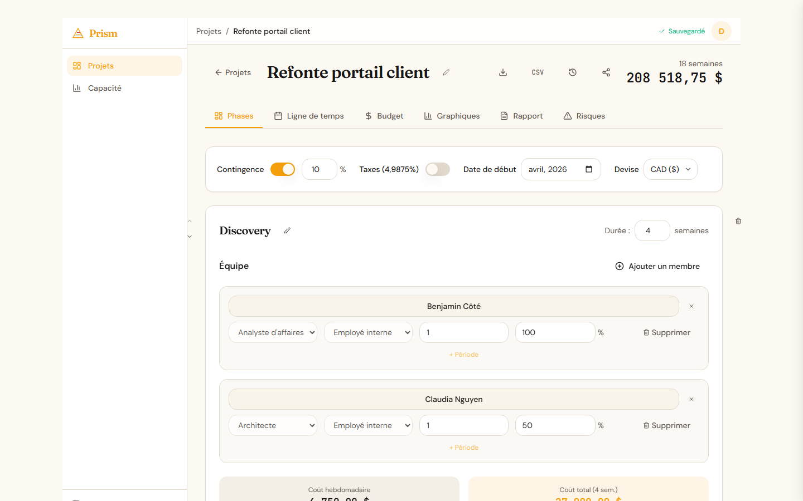 |

| Budget tracker                                    | Cost charts                                       |
| ------------------------------------------------- | ------------------------------------------------- |
| 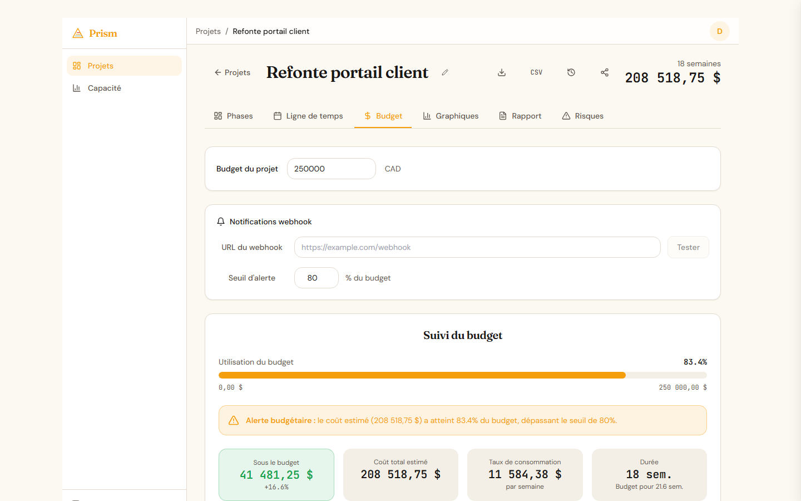 | 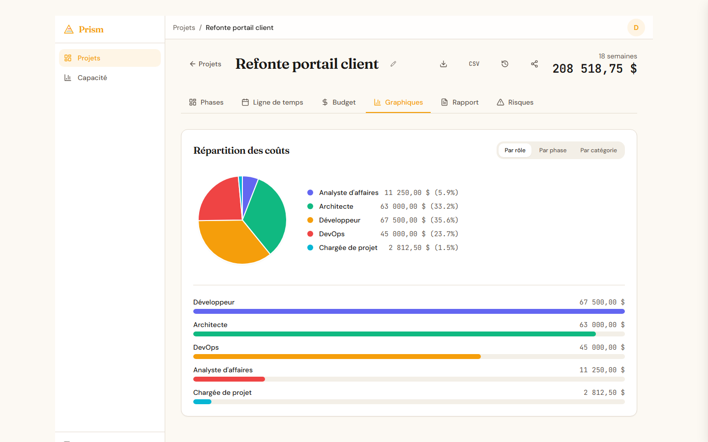 |

| Risk register                                   | Resource pool                                            |
| ----------------------------------------------- | -------------------------------------------------------- |
| 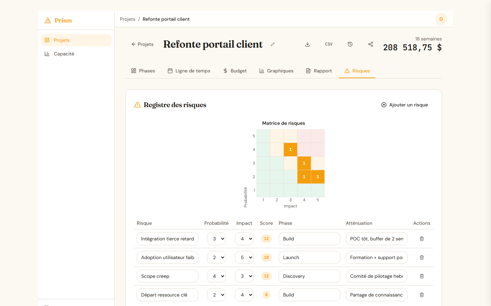 | 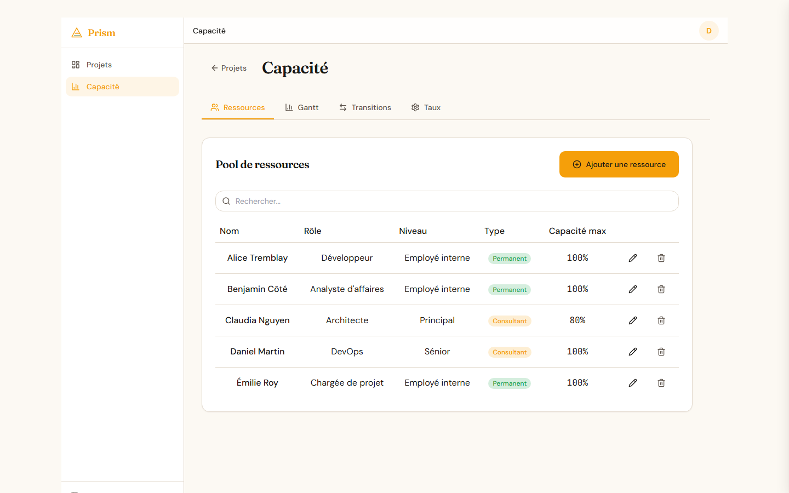 |

| Transition plans                                             | Enterprise rates                                 |
| ------------------------------------------------------------ | ------------------------------------------------ |
| 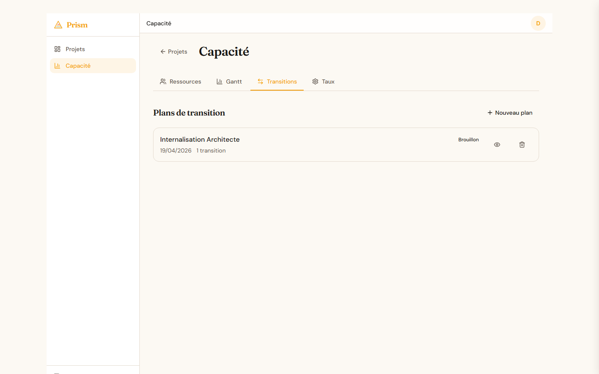 | 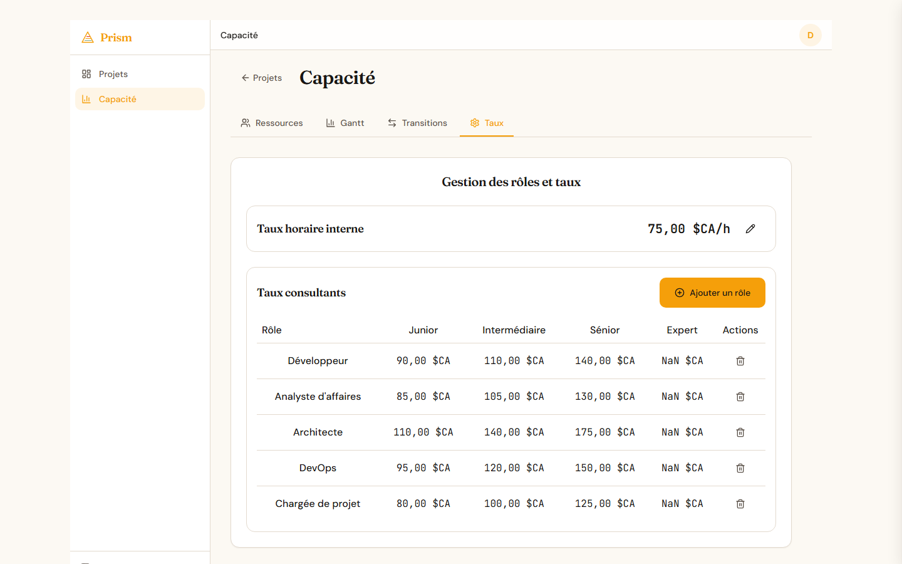 |

| Profile + API keys                          |
| ------------------------------------------- |
| 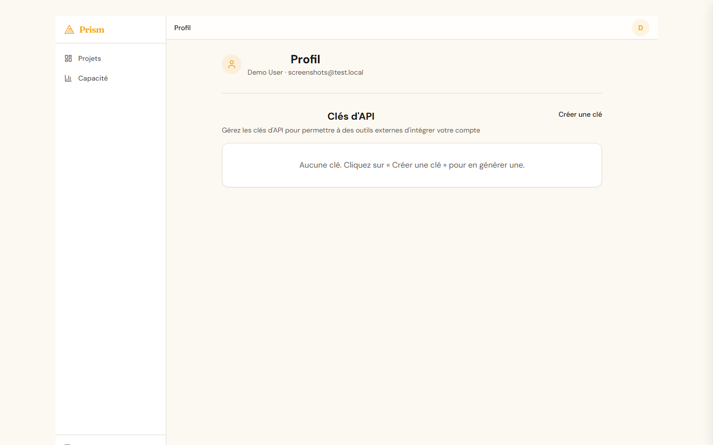 |

Screenshots are generated automatically by `scripts/screenshots/capture.mjs` from a deterministic fixture — see [`docs/ui-test-plan.md`](docs/ui-test-plan.md).

</details>

## Features

### Project Management

- Multi-project dashboard with create, duplicate, rename, import/export (JSON & CSV)
- Phase-based planning with team allocation, duration, and milestones
- Gantt-style timeline with week markers and cost breakdown table
- Scenario comparison across 2+ projects (side-by-side metrics)
- Project start date for capacity timeline alignment
- Hash-based URL routing (refresh-safe navigation)

### Capacity Management

- **Resource pool** — named individuals with role, level, and type (permanent/consultant)
- **Monthly Gantt view** — cross-project resource allocation with 12-month scrollable timeline
- **Project/Type grouping** — toggle between viewing by project or by permanent/consultant
- **Over-allocation detection** — red highlight when a resource exceeds max capacity
- **Utilization summary** — aggregate monthly utilization bar (green/amber/red)
- **Resource autocomplete** in project phases — link named resources from the pool
- **Period-scoped assignments** — resources can have start/end dates within a phase

### Transition Planning

- **Quick transition** — click a consultant in the Gantt to plan a single replacement
- **Scenario planner** — create multi-transition plans with cost comparison
- **Overlap management** — define handoff periods where both resources are active
- **Cost impact preview** — see projected savings before applying
- **Auto-sync** — applying a transition updates project team members, assignments, and periods

### Budgeting & Costs

- Enterprise-level rate card with 18+ roles and 5 experience levels
- Per-member cost proratization based on assignment periods
- Budget tracking with progress bar and variance analysis
- Non-labour cost categories (infrastructure, licenses, SaaS, travel, etc.)
- Multi-currency support: CAD, USD, EUR, GBP with locale-aware formatting
- Contingency percentage and Quebec tax (4.9875%) toggles

### Collaboration

- User accounts with email/password authentication (JWT)
- Project sharing by email with viewer/editor roles
- Project templates — save and reuse project structures
- Version history with named snapshots and restore

### Reporting & Visualization

- Cost charts (pie + bar) by role, phase, or category — with period proratization
- Printable project summary report with resource details, periods, and type badges
- Dashboard-level metrics: cost, duration, phases, team size

### UX

- Bilingual interface (French/English) with browser auto-detection
- Dark mode with system preference detection
- Auto-save with status indicator
- Responsive layout for mobile and desktop

## Public API (v1)

Public endpoint allowing external tools (e.g. roadmap tools) to create projects via a structured import.

**Full integration documentation**: see [`docs/integration-api-roadmap.md`](docs/integration-api-roadmap.md)

### Authentication

Calls to `/api/v1/*` use an **API key** (`X-API-Key: ckc_live_...`) distinct from the user JWT. Keys are generated from the profile (`#/profile`), scoped (`roadmap:import`, `roadmap:read`), and revocable at any time.

### Available endpoints

- `POST /api/v1/roadmap/import` — Create (or upsert with `?upsert=true`) a project from a roadmap
- `GET /api/v1/roadmap/import/:externalId/status` — Check if an `externalId` has already been imported

### Required configuration

Environment variables:

- `PUBLIC_API_ALLOWED_ORIGINS` — Allowed CORS origins (CSV list)
- `PUBLIC_BASE_URL` — Public URL used to build links returned to clients

### Security

- API keys hashed with SHA-256 in DB (direct lookup, 192 bits of entropy)
- Rate limiting: 60 requests/minute per key
- Strict CORS whitelist on `/api/v1/*`
- Audit log for each use (`api_key_usage` table)
- Strict Zod payload validation (schema, ISO dates, acyclic dependency graph)

## Tech Stack

| Layer    | Technology                                          |
| -------- | --------------------------------------------------- |
| Frontend | React 18, Tailwind CSS 3, Radix UI, Lucide icons    |
| Backend  | Node.js, Express 4                                  |
| Database | SQLite (better-sqlite3, WAL mode)                   |
| Auth     | JWT (jsonwebtoken), bcryptjs                        |
| Build    | Vite 5                                              |
| Test     | Vitest (40 tests — schema, calculations, API logic) |
| Deploy   | Docker (multi-stage), Nginx Proxy Manager           |
| i18n     | Custom React Context with ~350 translation keys     |

## Project Structure

```
src/
  App.jsx                      # Root — auth, routing, state, API sync
  lib/
    api.js                     # API client (auth, projects, templates, snapshots)
    capacityApi.js             # API client for capacity endpoints
    capacityCalculations.js    # Week-to-month, utilization, cost impact formulas
    costCalculations.js        # Cost formulas, currencies, period proratization
    projectStore.js            # Project/phase factories, export/import helpers
    i18n.jsx                   # Bilingual translations (FR/EN, ~350 keys)
    useHashRouter.js           # Lightweight hash-based routing
  components/
    AuthPage.jsx               # Login / register / password reset
    Dashboard.jsx              # Project list, compare mode, actions
    ProjectView.jsx            # Tabbed project editor (6 tabs)
    PhaseEditor.jsx            # Phase: team, duration, milestones, resource autocomplete
    TimelineView.jsx           # Gantt chart + cost table
    BudgetTracker.jsx          # Budget progress, burn rate, breakdown
    NonLabourCosts.jsx         # Non-labour cost items by category
    CostCharts.jsx             # Pie + bar charts (role/phase/category)
    ProjectSummary.jsx         # Printable report with resource details
    ScenarioComparison.jsx     # Side-by-side project comparison
    CapacityView.jsx           # Capacity management (4 sub-tabs)
    ResourcePool.jsx           # CRUD table for named resources
    ResourceForm.jsx           # Add/edit resource form
    CapacityGantt.jsx          # Monthly capacity Gantt timeline
    GanttBar.jsx               # Allocation bar element
    UtilizationSummary.jsx     # Monthly utilization summary row
    QuickTransition.jsx        # Single consultant replacement popover
    TransitionList.jsx         # Transition plan list with status badges
    TransitionPlanner.jsx      # Multi-transition scenario planner
    RolesRatesManager.jsx      # Enterprise rate card editor
    TemplateManager.jsx        # Save/load project templates
    ShareDialog.jsx            # Share project by email
    VersionHistory.jsx         # Snapshot list with restore
    ResourceConflicts.jsx      # Resource over-allocation warnings
    RiskRegister.jsx           # Risk matrix and mitigation tracking
    SaveIndicator.jsx          # Saving/Saved/Error status
    ThemeToggle.jsx            # Dark mode toggle
    ui/                        # Primitives: Button, Card, Switch, Label, Dropdown
  config/rates/                # Rate configuration (demo FR/EN + prod template)
  __tests__/
    capacityCalculations.test.js  # 18 tests for capacity calculations
server/
  index.js                     # Express entry — static + API + SPA fallback
  db.js                        # SQLite schema (8 tables), migrations, queries
  auth.js                      # Register, login, password reset routes
  data.js                      # Bulk data sync with resource assignment sync
  projects.js                  # Project CRUD, sharing, snapshots, assignment cleanup
  capacity.js                  # Capacity API: resources, assignments, gantt, transitions
  templates.js                 # Template CRUD routes
  middleware.js                # JWT auth middleware
  backup.js                    # Scheduled SQLite backups with retention
  __tests__/
    setup.js                   # Test DB helpers
    capacity.test.js           # 22 tests for schema and API logic
```

## Getting Started

### Prerequisites

- Node.js 18+
- npm

### Local Development

```bash
# Install frontend dependencies
npm install

# Install server dependencies
cd server && npm install && cd ..

# Start the backend (port 3000)
node server/index.js &

# Start the frontend dev server (port 5173, proxies /api to :3000)
npm run dev
```

Open `http://localhost:5173`. The Vite dev server proxies `/api` requests to the Express backend.

### Running Tests

```bash
# Run all tests (40 tests — backend + frontend)
npm test

# Watch mode
npm run test:watch
```

### Production Rates

To use custom rates instead of demo values:

1. Copy `src/config/rates/rates.prod.template.js` to `src/config/rates/rates.prod.js`
2. Edit with your actual hourly rates
3. `rates.prod.js` is gitignored

### Docker

```bash
# Build and run
docker build -t project-cost-calculator .
docker run -d -p 3002:80 \
  -v pcc-data:/data \
  -e JWT_SECRET=your-secret-here \
  project-cost-calculator

# Or with docker-compose (requires .env with APP_SLUG, APP_DOMAIN, JWT_SECRET)
docker compose up -d
```

The Docker image builds the frontend with Vite, then runs the Express server which serves both the API and the static files. SQLite data is persisted in the `/data` volume. Automated backups run every 24h with 7-day retention.

### Environment Variables

| Variable                | Default                   | Description                               |
| ----------------------- | ------------------------- | ----------------------------------------- |
| `PORT`                  | `80`                      | Server listen port                        |
| `JWT_SECRET`            | `change-me-in-production` | Secret for signing JWT tokens             |
| `DATA_DIR`              | `/data`                   | Directory for SQLite database and backups |
| `NODE_ENV`              | —                         | Set to `production` in Docker             |
| `BACKUP_INTERVAL_HOURS` | `24`                      | Hours between automated backups           |
| `BACKUP_MAX_COUNT`      | `7`                       | Number of backups to retain               |

## Database Schema

| Table                  | Description                                           |
| ---------------------- | ----------------------------------------------------- |
| `users`                | User accounts (email, name, password hash)            |
| `user_data`            | User settings and rates (JSON)                        |
| `projects`             | Project data (JSON blob per project)                  |
| `project_shares`       | Per-project sharing (viewer/editor roles)             |
| `project_snapshots`    | Version history snapshots                             |
| `templates`            | Reusable project templates                            |
| `resources`            | Named resource pool (name, role, level, max capacity) |
| `resource_assignments` | Resource-to-project-phase assignments with periods    |
| `transition_plans`     | Consultant-to-permanent transition scenarios          |

## API Reference

All endpoints except auth require `Authorization: Bearer <token>` header.

### Auth

| Method | Path                        | Description         |
| ------ | --------------------------- | ------------------- |
| POST   | `/api/auth/register`        | Create account      |
| POST   | `/api/auth/login`           | Login               |
| GET    | `/api/auth/me`              | Get current user    |
| POST   | `/api/auth/forgot-password` | Request reset token |
| POST   | `/api/auth/reset-password`  | Reset password      |

### Data

| Method | Path        | Description                                            |
| ------ | ----------- | ------------------------------------------------------ |
| GET    | `/api/data` | Load all projects + rates                              |
| PUT    | `/api/data` | Save all projects + rates (syncs resource assignments) |

### Projects

| Method | Path                                  | Description                                 |
| ------ | ------------------------------------- | ------------------------------------------- |
| GET    | `/api/projects`                       | List accessible projects                    |
| POST   | `/api/projects`                       | Create project                              |
| PUT    | `/api/projects/:id`                   | Update project (syncs resource assignments) |
| DELETE | `/api/projects/:id`                   | Delete project (owner only)                 |
| POST   | `/api/projects/:id/share`             | Share with user                             |
| DELETE | `/api/projects/:id/share/:userId`     | Remove share                                |
| GET    | `/api/projects/:id/shares`            | List shares                                 |
| GET    | `/api/projects/:id/snapshots`         | List version snapshots                      |
| POST   | `/api/projects/:id/snapshots`         | Create snapshot                             |
| POST   | `/api/projects/snapshots/:id/restore` | Restore snapshot                            |

### Capacity

| Method | Path                                   | Description                                          |
| ------ | -------------------------------------- | ---------------------------------------------------- |
| GET    | `/api/capacity/resources`              | List resource pool                                   |
| POST   | `/api/capacity/resources`              | Create resource                                      |
| PUT    | `/api/capacity/resources/:id`          | Update resource                                      |
| DELETE | `/api/capacity/resources/:id`          | Delete resource (cascades assignments)               |
| GET    | `/api/capacity/assignments`            | List assignments (filters: month, resource, project) |
| POST   | `/api/capacity/assignments`            | Create assignment                                    |
| PUT    | `/api/capacity/assignments/:id`        | Update assignment                                    |
| DELETE | `/api/capacity/assignments/:id`        | Delete assignment                                    |
| GET    | `/api/capacity/gantt`                  | Gantt data (start/end month range)                   |
| GET    | `/api/capacity/transitions`            | List transition plans                                |
| POST   | `/api/capacity/transitions`            | Create transition plan                               |
| PUT    | `/api/capacity/transitions/:id`        | Update plan                                          |
| DELETE | `/api/capacity/transitions/:id`        | Delete plan                                          |
| POST   | `/api/capacity/transitions/:id/apply`  | Apply plan (updates assignments + project)           |
| GET    | `/api/capacity/transitions/:id/impact` | Calculate cost impact                                |

### Templates

| Method | Path                 | Description         |
| ------ | -------------------- | ------------------- |
| GET    | `/api/templates`     | List user templates |
| POST   | `/api/templates`     | Create template     |
| DELETE | `/api/templates/:id` | Delete template     |

## URL Routing

The app uses hash-based routing for refresh-safe navigation:

| URL                   | View                       |
| --------------------- | -------------------------- |
| `#/projects`          | Dashboard                  |
| `#/projects/:id`      | Project (phases tab)       |
| `#/projects/:id/:tab` | Project with specific tab  |
| `#/capacity`          | Capacity (resources tab)   |
| `#/capacity/:tab`     | Capacity with specific tab |

## FAQ / Troubleshooting

### Installation and setup

**`npm install` fails with native errors (better-sqlite3)**
The project uses `better-sqlite3` which compiles natively. Make sure you have Node.js 20+ and the build tools:

- Windows: `npm install --global windows-build-tools` (or Visual Studio Build Tools)
- macOS: `xcode-select --install`
- Linux: `sudo apt install build-essential python3`

**Port 3000 is already in use**
Change the port via the `PORT` env var: `PORT=3001 npm run dev`

### Development

**Tests are slow on the first run**
Vitest compiles and caches modules. After the first run, it's ~10x faster. For watch mode: `npx vitest`.

**Auto-save is not working**
Check the browser console: a `401` means the JWT has expired (30d). Log in again. A `500` may indicate a SQLite issue (disk full, permissions on `data/`).

**API keys are not working**

- Check that the key starts with `ckc_live_`
- Check that it has not been revoked (Profile > API Keys)
- Check the scope (`roadmap:import` vs `roadmap:read`)

### Deployment

**Docker container crashes on startup with `ERR_MODULE_NOT_FOUND`**
Check that all backend deps are in `server/package.json`, not only in the root `package.json`. See commit `0143f92` for the zod bug example.

**Port mapping does not work behind nginx-proxy-manager**
If `docker-compose.yml` has no `ports:` mapping (uses Traefik only), add it manually after each `docker compose up`:

```bash
sed -i '/restart: unless-stopped/a\    ports:\n      - "3002:80"' docker-compose.yml && \
  docker compose up -d && git checkout docker-compose.yml
```

**Env vars `PUBLIC_API_ALLOWED_ORIGINS` and `PUBLIC_BASE_URL` are not read**
Check that they are in the root `.env` and that `docker-compose.yml` references them via `env_file: .env`.

### Public API integration

**Error 409 `duplicate_external_id` for what is a new project**
The `externalId` is unique per user. Either change the value, or use `?upsert=true` to update the existing project.

**Error 422 `validation_error: durationMonths is required`**
Provide either `durationMonths` or BOTH dates (`startDate` AND `endDate`) on each phase. See [`docs/integration-api-roadmap.md`](docs/integration-api-roadmap.md).

**Dependencies (`dependsOn`) do not show in the Gantt**
Intentional (for now): dependencies are stored but the Gantt visualization uses `order` + cumulative durations. Future feature.

### Other

**Where is the data stored?**
Local SQLite in `data/app.db`. Automated backups in `data/backups/` (hourly).

**How do I reset the database?**
Delete `data/app.db` and restart. Migrations will re-run automatically (`server/db.js`).

**How do I add a language other than FR/EN?**
Edit `src/lib/i18n.jsx`, add a 3rd translations object, and extend the language selector in `ThemeToggle` or create a `LocaleToggle`.

## License

This project is licensed under the MIT License — see [LICENSE](LICENSE) for details.

## Contributing

See [CONTRIBUTING.md](CONTRIBUTING.md) for development setup and guidelines.
